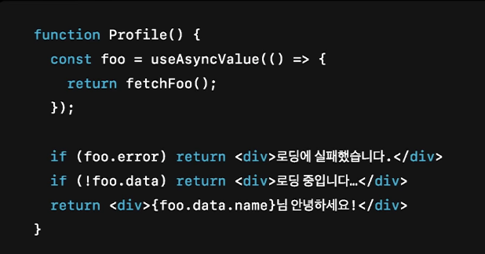
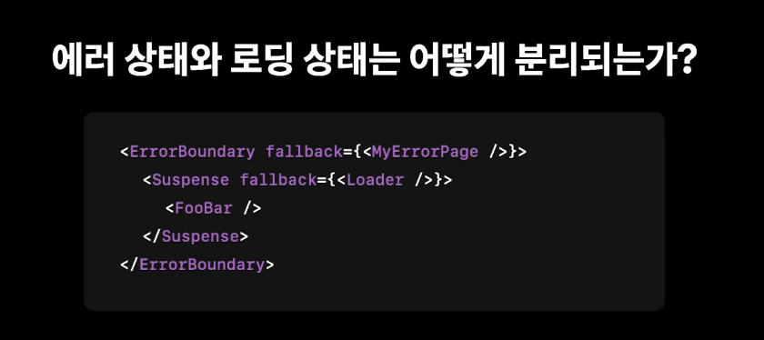

- [토스ㅣSLASH 21 - 프론트엔드 웹 서비스에서 우아하게 비동기 처리하기](https://www.youtube.com/watch?v=FvRtoViujGg)
	- 비동기 문제를 어떻게 더 선언적인 코드로 해결할 수 있는지 소개하는 영상

- 비동기 프로그래밍으로 인해 순서가 보장되지 않는 상황
	- 서버에 요청을 보냈을 때 응답만 기다리고 다른 유저의 인터랙션에 반응하지 않는 경우 -> 서버에 요청 보내고, 다른 작업을 하다가 응답이 돌아오면 추후 작업을 처리하도록

### 안좋은 비동기 코드
- 성공하는 경우와 실패하는 경우가 섞여서 처리
- 매번 비동기 호출을 할 때마다 에러 처리를 해줘야 함

### 좋은 비동기 코드
- 성공, 실패 케이스를 분기해서 처리할 수 있어 비즈니스 로직을 한눈에 파악할 수 있음
- async/await 문법의 좋은 점: 성공하는 경우만 다루고 실패하는 경우를 분리해서 처리할 수 있다. -> 실패하는 경우에 대한 처리를 외부에 위임

## 리액트

### 안좋은 코드

- 여러 개의 비동기 작업이 동시에 실행되어야 하는 경우
	- bar를 가져오기 위해서는 foo를 가져와야 하는 경우
	- 2개의 비동기 작업이라면? 9가지의 상태에 대해 처리해줘야 함

- 리액트에서는 async/await처럼 비동기 처리를 할 수 있는 문법이 없었음
- -> 성공하는 경우에만 집중해서 컴포넌트를 구성하기 어려움, 여러 개의 비동기 작업이 필요할 때 상태 별로 섞여서 로직을 작성해야 해서 비즈니스 로직 파악이 어려움

### React Suspense for Data Fetching 등장
- async/await 처럼 비동기를 처리할 수 있는 문법 
1. 성공한 경우에만 집중
2. 로딩 상태와 에러 상태를 분리
3. 동기처럼 사용할 수 있는

-> 컴포넌트는 성공한 상태만 다루고, 로딩 상태와 에러 상태는 외부에 위임, 동기적인 코드처럼 작성할 수 있게 된다.

### 작성 방법

- 컴포넌트를 사용하는 곳에서 로딩 처리와 에러 처리를 한다
- 로딩 상태는 가장 가까운 Suspense의 Fallback으로 그려진다
- 에러 상태는 가장 가까운 ErrorBoundary가 componentDidCatch 로 처리

- 비동기 작업이 포함된 함수나 컴포넌트를 에러 핸들링하는 부분으로 감싸진 구조로 유사한 형태
- 모든 경우 try/catch하지 않는 것처럼 suspense를 일으키는 모든 컴포넌트에 다 붙이는게 아니라 적당한 단위로 한번에 처리해주면 됨
- 라이브러리에서 제공하는 api를 사용(ex. react-query suspense: true) -> 컴포넌트의 suspense 상태 관리

-> 로딩과 에러 처리를 바깥으로 위임하여 비동기 작업을 동기처럼 처리할 수 있게 함

### 리액트에서 Suspense를 어떻게 구현했을까?
- fetchTextSync 함수는 비동기 작업을 하지만 동기처럼 사용하고 있음 
- -> runPureTask 런타임 구현을 통해 가능

## React Hooks와 Suspense의 유사성
### React Hooks
- Before hooks, 클래스 컴포넌트로 컴포넌트의 라이프 사이클에 맞춰 다양한 작업을 명령형으로 작성
- **선언적인** API
	- useState: 상태 사용 선언, useMemo 메모이제이션 사용 선언, useEffect 효과 사용 선언
	- 리액트 프레임워크에서 선언한대로 대신 작업
- suspense도 마찬가지로 비동기 처리를 선언적으로 할 수 있게 해준 API
	- 컴포넌트에서 비동기적인 리소스 선언, 그 값을 사용한다고 선언
	- 실제 로딩 상태나 에러 상태 처리는 부모 컴포넌트에게 위임
- 대수적 효과